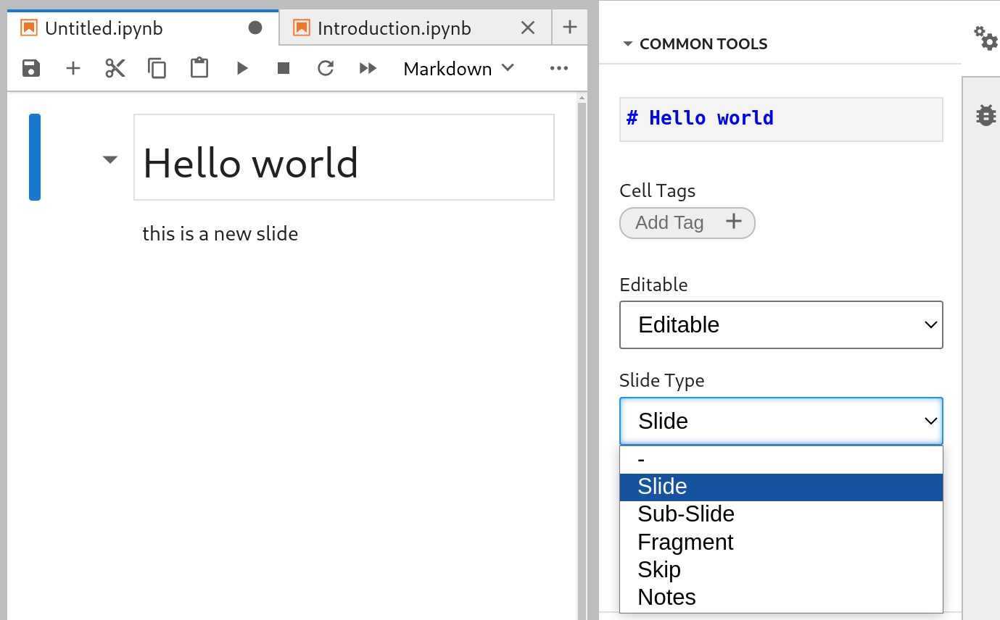
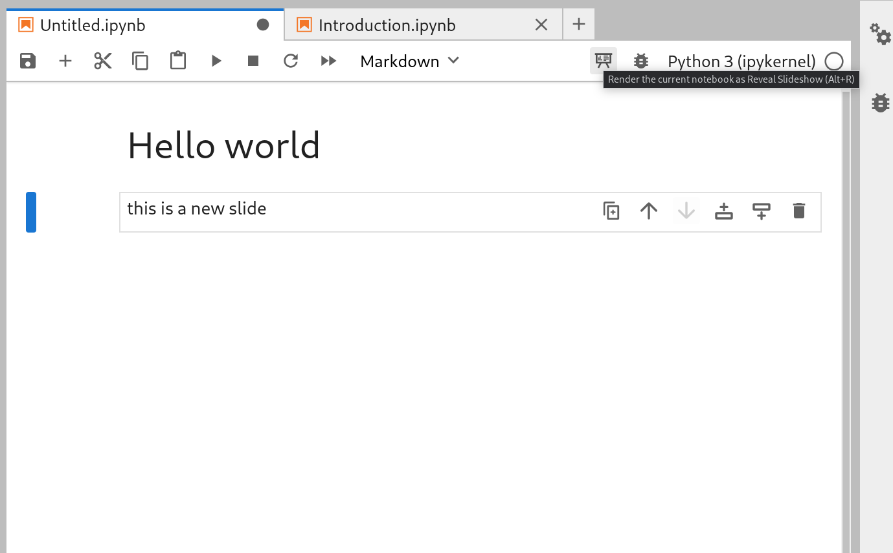

The actual website can be viewed at [https://UOdsci.github.io/dsci345/](https://UOdsci.github.io/dsci345/).

Quick link: the [schedule](https://UOdsci.github.io/dsci345/pages/schedule.html), with links to the slides.


--------------------


This is a [jekyll](https://jekyllrb.com) website,
modified from Karl Broman's [simple site](http://github.com/kbroman/simple_site)
by way of [Cécile Ané](http://cecileane.github.io/computingtools/).


*Notes on installation/building:*

- To view a local version, install `jekyll` and run `bundle exec jekyll serve`
    (to do a "hard reset", remove `Gemfile.lock` and `_site/` and try again)

- The skeleton can by modified by editing `config.yml` and `_includes/themes/twitter/default.html`.

- To get this to build locally with Debian, I had to `aptitude remove jekyll`; `bundle update`; 
    then find where the executable is using `bundle info jekyll`; 
    and finally make a symlink for the `jekyll` executable to somewhere in my `PATH`.


-------------------

The slides are written in jupyter,
rendered using [RISE](https://pypi.org/project/jupyterlab-rise/).
(For background, see notes
[here](https://www.markroepke.me/posts/2019/05/23/creating-interactive-slideshows-in-jupyter.html)
and [here](https://www.markroepke.me/posts/2019/06/05/tips-for-slideshows-in-jupyter.html),
but note these are for the previous, jupyter notebook, package `rise`.)

Prerequisites for executing and showing the slides are in `requirements/conda-environment.yml`:
(*note: you may need to replace `conda` with e.g., `micromamba`*)
```
conda env create -f requirements/conda-environment.yml 
conda activate dsci
```
Then open the slides with `jupyter lab`.

To create slides you add the type of slide to the *metadata*:
in jupyterlab, you specify the type of slide after clicking the gears in the sidebar:

Slides can have more than one cell; only label the first one.
Then click the 'present' icon to start:


*Note:* previous versions of these slides were developed using `rise`;
but this has been replaced by
[`jupterlab_rise`](https://pypi.org/project/jupyterlab-rise/).
